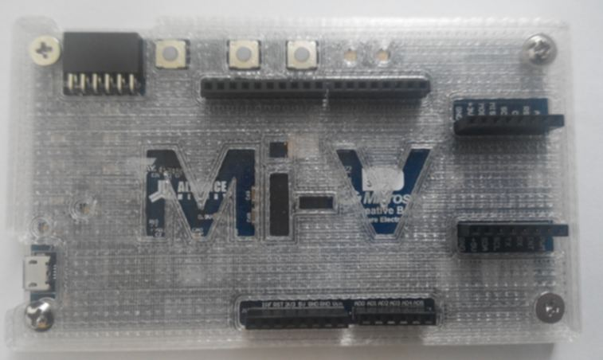

# Machine learning - linear regression with Titanic dataset

This SoftConsole C++ example project demonstrates how to linear regresion is used in machine learning and uses floating point arithmetic on a Mi-V Soft processor running **40MHz** on Future Electronics Creative Board M2S025/M2GL025. But can be easily used with Security Eval Kit featuring M2S090.

```
Confusion matrix:

                  | Predicted death | Predicted survival |
------------------|-----------------|--------------------|
Actually died     |             354 |                 70 |
Actually survived |              73 |                217 |
----------------------------------------------------------
total_entries=714, correctly_predicated=571, accuracy=0.799720 

```

The dataset and weight/bias was achived with the following script:
https://github.com/truhlikfredy/machine-learning-experiments/blob/master/src/titanic-mk2.ipynb
Part of the training was cleaning data which then was saved in clean/normalized form into **titanic-data.c** file.


# Mi-V Soft processor
This example uses a Mi-V Soft processor MiV_RV32IMAF_L1_AHB. The design is built for debugging MiV_RV32IMAF_L1_AHB through the SmartFusion2 FPGA programming JTAG port using a FlashPro5. 

All the platform/design specific definitions such as peripheral base addresses, system clock frequency (preconfigured for 40MHz) etc. are included in hw_platform.h. The hw_platform.h is located at the **src** folder of this project.

The MiV_RV32IMAF_L1_AHB firmware projects need the riscv_hal and the hal firmware (RISC-V HAL).

The RISC-V HAL is available through Firmware catalog as well as [from the GitHub repository](https://github.com/RISCV-on-Microsemi-FPGA/riscv-hal):

https://github.com/RISCV-on-Microsemi-FPGA/riscv-hal

# How to use this example
This example project requires USB-UART interface to be connected to a host PC. The project is not using anything else than UART, no other internal/external peripheral is required. It's using default settings at 115200 baud rate. By default it's using 80x40 terminal. On Windows The host PC must connect to the serial port using a terminal emulator such as HyperTerminal or PuTTY configured as follows:
* 115200 baud
* 8 data bits
* 1 stop bit
* no parity
* no flow control

Linux users could use:
```bash
screen /dev/ttyUSB0 115200
``` 
Or any equivalent serial terminal application (e.g. minicom). For more help see:

https://wiki.archlinux.org/index.php/working_with_the_serial_console

Project settings have predefined **MSCC_STDIO_THRU_CORE_UART_APB** so all regular printf calls should be redirected to UART. This allows the code be generic enough to run on x86 **Linux** host. A script **runOnLinuxHost.sh** script and **ML-titanic-on-Linux-host** launcher are made for this purpose.

The launcher should be visible from external tools. If it's not, then it might be required to disable **Filter Configuration Types** filter first. If this project was cloned from the GitHub repository it might have default file permission on the script and then the launcher will fail, the permissions can be changed within the SoftConsole with a right click on the script and clicking Properties.


The program iterates the pasenger list and tries to predict outcome, then it compares to actual value. In the end program will output the final confusion matrix with the resulting accuracy. The example is getting 79% accuracy as it is simple linear regression. All the output can be observed only through UART (not GPIO LEDs or anything else present).


# Target hardware
This example project is targeted at a Future Electronics Creative Board which is based on IGLOO2 or SmartFusion2 M2GL025/M2S025 chips. The example project is built using a clock frequency of 40MHz. Trying to execute this example project on a different design will result in incorrect baud rate being used by UART (so tweak the source code as required).



This example project can be used with another design using a different clock configuration. This can be achieved by overwriting the content of this example project's "hw_platform.h" file with the correct data from your Libero design.

The release mode configuration for this example project uses microsemi-riscv-ram.ld 
linker script. This Linker script is specific for the SmartFusion2 target. It creates the executable image for the SRAM memory area. 

An example design for SmartFusion2 90 Security Eval Kit is available at:

https://github.com/RISCV-on-Microsemi-FPGA/M2S090-Security-Eval-Kit

# Silicon revision dependencies
This example is tested on M2S025 and M2S090 device.